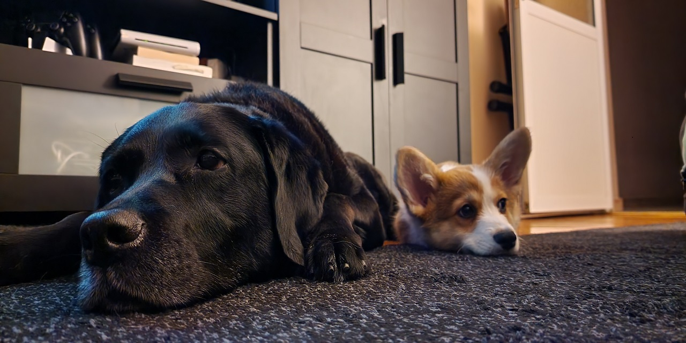

### Hi there 👋 My name is Ivan and I have just started learning C# with the goal of becoming a Developer ! 
-----------------------------------------------------------------------------------------------------------------------------------------------

_______________________________________________________________________________________________________________________________________________

------------------------------------------------------------------------------------------------------------------------------------------------

🔭 I’m currently working as a dispatcher in a transporation firm based out of Chicago, IL, USA.

------------------------------------------------------------------------------------------------------------------------------------------------

📫 How to reach me:  | Email me on lcfrrr@gmail.com or PM me on Facebook ----> https://www.facebook.com/lcfrrr/

-------------------------------------------------------------------------------------------------------------------------------------------------

⚡ Fun fact: Kind of a neat freak, everything needs to be in it's place ! 😁 

------------------------------------------------------------------------------------------------------------------------------------------------

🐶 I have two dogs - A black Labrador and a small Corgi. I guess you've already seen the picture, right ? 

"Without ambition one starts nothing. Without work one finishes nothing. The prize will not be sent to you. You have to win it."

<!--
**I-M-Marinov/I-M-Marinov** is a ✨ _special_ ✨ repository because its `README.md` (this file) appears on your GitHub profile.

Here are some ideas to get you started:

- 🔭 I’m currently working on ...
- 🌱 I’m currently learning ...
- 👯 I’m looking to collaborate on ...
- 🤔 I’m looking for help with ...
- 💬 Ask me about ...
- 📫 How to reach me: ...
- 😄 Pronouns: ...
- ⚡ Fun fact: ...
-->
