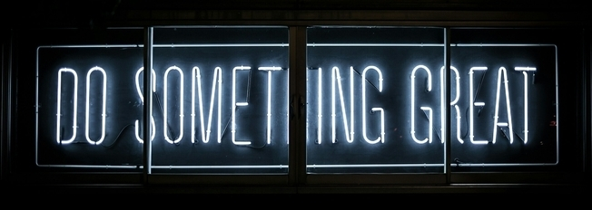

## Hi there 👋 My name is Ivan and I am on the path of becoming a Developer ! 

-----------------------------------------------------------------------------------------------------------------------------------------------

⠀⠀⠀⠀⠀⠀⠀⠀⠀⠀⠀⠀⠀⠀⠀⠀⠀

⠀⠀⠀⠀⠀⠀⠀⠀⠀⠀⠀⠀⠀⠀⠀⠀⠀⠀⠀⠀⠀⠀⠀⠀⠀⠀⠀⠀⠀⠀⠀⠀⠀⠀⠀⠀⠀⠀⠀⠀
⠀⠀⠀⠀⠀⠀⠀⠀⠀⠀⠀⠀⠀⠀⠀⠀⠀⠀⠀⠀⠀⠀⠀⠀⠀⠀⠀⠀⠀⠀⠀⠀⠀⠀⠀⠀⠀⠀⠀⠀⠀⠀⠀
------------------------------------------------------------------------------------------------------------------------------------------------

🔭Last position I held was dispatcher in a transporation firm based out of Chicago, IL, USA.

------------------------------------------------------------------------------------------------------------------------------------------------

📫 How to reach me:  | Email me on ivan.marinov.maronov@gmail.com or PM me on LinkedIn ----> [<kbd>Ivan Marinov</kbd>](https://www.linkedin.com/in/ivan-marinov-71107684/))

-------------------------------------------------------------------------------------------------------------------------------------------------

⚡ Fun fact: Kind of a neat freak, everything needs to be in it's place ! 😁

------------------------------------------------------------------------------------------------------------------------------------------------

🐶 I have two dogs - A black Labrador and a small Corgi.

> "Without ambition one starts nothing. Without work one finishes nothing. The prize will not be sent to you. You have to win it."
⠀⠀⠀⠀⠀⠀⠀⠀⠀⠀⠀⠀⠀⠀⠀⠀⠀⠀⠀⠀⠀⠀⠀⠀⠀⠀⠀⠀⠀⠀⠀⠀⠀⠀⠀⠀⠀⠀⠀⠀⠀⠀⠀⠀⠀⠀⠀⠀⠀⠀⠀⠀⠀⠀⠀⠀⠀⠀⠀⠀⠀⠀⠀⠀⠀⠀⠀⠀⠀⠀⠀⠀⠀⠀⠀⠀ ― Ralph Waldo Emerson
                                                                                            

<!--
**I-M-Marinov/I-M-Marinov** is a ✨ _special_ ✨ repository because its `README.md` (this file) appears on your GitHub profile.

Here are some ideas to get you started:

- 🔭 I’m currently working on ...
- 🌱 I’m currently learning ...
- 👯 I’m looking to collaborate on ...
- 🤔 I’m looking for help with ...
- 💬 Ask me about ...
- 📫 How to reach me: ...
- 😄 Pronouns: ...
- ⚡ Fun fact: ...
-->
